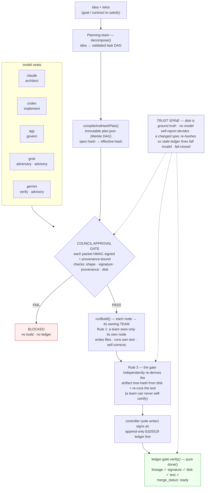

# TELOS

[](https://github.com/dsmcewan/TELOS/actions/workflows/ci.yml)

> An AI agent that grades its own work can rubber-stamp its own mistakes. TELOS
> makes the thing that *builds* never be the thing that *certifies*: a build's
> claim is data; the disk is the truth.

**A multi-model build system where nothing merges on a model's say-so.**
Independent AI model **seats** (claude / grok / codex / agy / gemini) produce
signed, provenance-bound approval packets; a deterministic **gate** certifies
merge-readiness from disk + signatures + provenance — never from a model's
self-report. The same trust spine drives software from idea to merged, verified
artifacts, and now governs the plan *before* it runs (see **Proposal Lifecycle**
below): a candidate must survive adversarial cold review and produce a verified
implementation contract before any irreversible step.

## How it works



Read it two ways: the top half (seats → approval gate) is TELOS deciding
*whether* work is merge-ready; the whole pipeline is the **autonomous builder**
taking an idea to verified, merged artifacts. The thing that *builds* is never the
thing that *certifies* — a team's claim is data; the disk is truth.

## Components

**The substrate (engine):**

- **`build-gate/`** — the gate (`gate.mjs`), per-model HMAC signing (`sign.mjs`), the
  dynamic-workflow council orchestrator (`council.mjs`: per-job seat sizing +
  CPU-bounded fan-out + `liveSeatCaller`), strict-mode JSON Schemas for the three
  contracts (`schemas.mjs`), per-model strength profiles (`model-profiles.mjs`),
  and the seat→backend registry (`seat-registry.mjs`: routes each council tool to
  ai-peer-mcp or a claude-plugins seat server, `TELOS_PLUGINS_DIR`-configurable).
- **`breakout/`** — self-challenge with verdict-on-facts (`verifier.mjs`, `live.mjs`),
  a minimal MCP stdio client (`mcp_client.mjs`: Content-Length or ndjson framing),
  and the multi-server seat router (`seat_router.mjs`: same `callTool` surface
  `liveSeatCaller` already consumes, fail-closed on unrouted tools).
- **`connectors/ai-peer-mcp/`** — MCP server exposing the model backends
  (`claude_ask` / `grok_ask` / `codex_ask` / `gemini_ask` / `agy_checkpoint`) with
  **real per-seat provenance** and **provider-native structured output** (each
  contract schema is translated to that provider's native form — OpenAI/xAI
  `json_schema` strict, Anthropic forced tool call, Gemini `responseSchema`).
- **`merkle-dag/`** — content-addressed planning + verified delegation + a pure
  `done()` evaluator (`ledger-gate.mjs`): immutable `plan.json`, append-only signed
  `ledger.jsonl`, Ed25519 settlement, forward-invalidation by hash. Also
  **verification obligations** (`obligation.mjs`: content-addressed obligation
  identity, done()-time discharge) and the **signed proposal-lifecycle ledger**
  (`proposal-ledger.mjs`: hash-chained `.telos/proposal.jsonl`, atomic single-lock
  append, `POLICY_CONTRACT_V1` + layered authorization verifiers).

**The autonomous layers (composed on the substrate, no new trust surface):**

- **`build-gate/` agentic-teams** — `teams.mjs` (the team roster as data),
  `decompose.mjs` (idea → validated task DAG), `build-orchestrator.mjs`
  (`buildProject` — the full lifecycle), `teamPrompts.mjs` (live wiring over
  `ai-peer-mcp`), `situation.mjs` (project sense), `test-runner.mjs` (runtime
  self-correction).
- **`build-gate/` proposal-lifecycle (Daedalus)** — audited-judgment governance
  BEFORE execution (opt-in `dossier.proposal_lifecycle === true`; legacy advisory
  mode is byte-identical). `daedalus.mjs` (the bounded claude/codex planning
  workshop), `concerns.mjs` (typed concerns/holds/controller-only dispositions),
  `risk-policy.mjs`, `evidence.mjs` (closed-whitelist sandboxed verifier),
  `proposal-gate.mjs` (reconstructs proposal state from the ledger),
  `proposal-recorder.mjs` (sole-writer), `standing.mjs` (pure calibration). See
  `contracts/Proposal Lifecycle.md`.
- **`saas-forge/`** — a 7-team SaaS generator that drives a project to
  market-ready, each team put through an adversarial breakout-on-facts.
- **`ai-forge/`** — pattern-library-driven forge for AI architectures; Phase A: the
  RAG pattern (7 workstreams, fully converged over the real gate + Ed25519 ledger).

## Autonomous builder (agentic-teams)

The council only *approves*; the merkle-dag substrate only *executes* anonymous
worker nodes. The agentic-teams layer composes them so **a build/verify team IS a
`runBuild` worker** — it sees only its node's spec (Rule 1) and its output is
independently re-derived by the gate (Rule 3), so a team's self-report can never
satisfy the gate.

```
idea + telos
  → [planning team] decompose() → tasks[]
  → compileAndHashPlan() → content-addressed plan; writePlan()
  → COUNCIL APPROVAL GATE: runCouncil → validateRecords   (must pass before any execution)
  → runBuild(): each node dispatched to its owning team (team = worker)
  → Rule-3 verify: re-derive the artifact tree-hash + run the node's own test
  → settle: the controller (sole writer) signs the Ed25519 ledger
  → ledger-gate.verify() done() → merge_status: "ready"
```

- **Team placement by strength** (`teams.mjs` + `model-profiles.mjs`): each lead is
  matched to its model's strength (a test asserts every lead's role is in that
  model's `preferred_roles`) — planning/architecture/frontend → claude,
  backend/evals → codex, security/business/breakout → grok, ops → agy,
  **integrity → gemini**. `planTeams(dossier)` sizes the roster from the job.
- **Situational awareness** (`situation.mjs`, pure read-only): greenfield vs
  brownfield, write-target collisions, and the project's real test command —
  reported before building, never used to self-certify.
- **Runtime adaptation** (`test-runner.mjs`): after a team writes its node's files,
  its own node test runs; on failure the team is re-called with the failure detail
  to self-correct (bounded), then the substrate's halt → mutate → re-dispatch gives
  a second, outer adaptation level.

## Proposal Lifecycle (Daedalus)

The agentic-teams path answers *whether work is merge-ready*. The proposal
lifecycle answers a prior question — *is this plan mature enough to authorize?* —
by putting a candidate through audited judgment before any irreversible step. It
implements `contracts/Proposal Lifecycle.md` and adds **no new root of trust**:
every decision reduces to the existing primitives (content hashes, signatures,
provenance, deterministic policy, re-verifiable evidence, disk as ground truth).

```
idea + telos
  → draft
  → Daedalus workshop (claude/codex negotiation; content-addressed rounds)
  → compileAndHashPlan() → immutable candidate (obligations + lifecycle bound into plan_hash)
  → COLD REVIEW of the exact written plan hash (creation/review lineage disjoint, provider-scoped)
  → typed concerns → holds / dispositions / verification obligations
  → deterministic decision: authorized | revise | blocked | human-review-required
  → runBuild(): reads the authorized decision + closed policy certificate FROM DISK, keyed by the
       recomputed plan hash — then Rule-3 execution + obligation discharge
```

The governing rule, and the one most likely to catch a design flaw: **no mutable
label keys an enforcement decision; every enforcement identity is a
controller-derived content address.** So `proposal_ref` is the recomputed plan
hash (never `build_id`), obligation identity is a hash of its semantics (never a
label), the gate reconstructs concern state from the ledger (never a
caller-supplied array), and `runBuild` reads authorization from disk (never a
caller-supplied selector).

- **Sole-writer, atomic ledger** (`proposal-recorder.mjs` + `proposal-ledger.mjs`):
  a durable controller key; every append rereads + verifies + derives the head
  under one lock, so holds, TTL expirations, and later evidence safely span
  processes and a self-fork is impossible.
- **Model judgment is an interrupt, not a certificate** (`concerns.mjs`): evidence
  certifies; audited judgment blocks or holds; deterministic policy decides. A
  judgment-only hold fails safe (liveness, not integrity); a verified blocker needs
  independently re-verifiable evidence.
- **Sandboxed evidence** (`evidence.mjs`): a frozen closed whitelist; executable
  evidence runs in a real filesystem + network namespace and is rejected without
  execution when isolation is unavailable.
- **Calibration, not authority** (`standing.mjs`): reviewer standing is recomputed
  from the ledger, influences hold TTL / escalation only, and a new concrete model
  version starts conservative (never inherits a predecessor's reputation).

Keyless end-to-end evidence: `docs/runs/proposal-lifecycle/` (authorized→`ready`,
undischarged-obligation→blocked, unauthorized-decision→refused). This subsystem's
own design was put through the process it implements — see
[Designing a trust system by adversarial review](docs/design-by-adversarial-review.md)
(the contract was frozen over three review rounds; the implementation plan was
revised seven times, each answering a numbered findings list, before a line was
written).

## AI Forge (`ai-forge/`)

Pattern-library-driven forge for AI architectures on the unchanged TELOS trust spine.
Phase A is complete: `forge({ pattern: ragPattern, ctx: ragContext(), ... })` returns
`converged: true` over the real gate + Ed25519 ledger + merkle-dag (see `docs/runs/ai-forge-rag/`).
Phase B is complete: every forge run now also emits a gate-verified `DESIGN.md` via a
generic `design` workstream — the architecture design is a first-class, fail-closed
artifact checked against the plan + ledger + built tree (8 workstreams total; all converge).
Phase C is complete: the catalog now includes the self-similar **TELOS pattern** — ai-forge
forges a TELOS-like trust system (7 spine-wrapping components + design; 8 workstreams converge;
see `docs/runs/ai-forge-telos/`).
Phase C.2 is complete: the catalog now also includes **multi-agent**, **eval-harness**, and
**serving+guardrails** patterns — each an independent 8-workstream run converged over the real
gate + Ed25519 ledger (see `docs/runs/ai-forge-{multiagent,eval,serving}/`; PRs #49–60).

## SaaS Forge (`saas-forge/`)

Point the forge at a project and it drives it to **market-ready** the TELOS way:
research the capabilities a SaaS needs → generate each team's artifacts via the
merkle-dag `dispatch` → put **every team through an adversarial breakout decided on
its built artifact** (facts, not trivia) → settle a signed ledger → market gate,
looping until certified.

| Team | Artifact | Breakout asserts (on disk) |
| --- | --- | --- |
| product-architecture | `docs/ARCHITECTURE.md` | references the researched stack |
| business-positioning | `docs/POSITIONING.md` | ICP + differentiation |
| backend-schema | `db/schema.sql` | tables + RLS `create policy` |
| security-trust | `web/site/csp.txt` | `Content-Security-Policy` / `default-src` |
| accuracy-evals | `evals/scorecard.json` + `run.mjs` | precision clears threshold (the test runs the eval) |
| scale-operations | `docs/OPERATIONS.md` | S3 + CloudFront + SLOs |
| frontend-brand-experience | `web/*` + screenshots | brand token, first-screen proof band |

Market packets are **generated from the breakout records**, never hand-asserted,
and the gate independently re-verifies every team's record on disk.

## Trust model (fail-closed)

- Each required seat's packet is **HMAC-signed** and carries **real provenance**:
  the server-issued response id for remote models (claude/grok/codex/gemini), or a
  content-addressed **local attestation** (`agy-<sha256>`) for the deterministic
  agy seat. No structured provenance ⇒ `response_id: null` ⇒ the gate blocks, as
  does a placeholder id or a `response_id` shared across two seats — **no seat
  borrows another's id**. What the gate cannot do from disk is prove a well-formed,
  *unique* id is genuine rather than fabricated (it can't re-contact the API); that
  binding to the real response is made by the council wiring at generation time,
  with the per-seat HMAC secret as the identity floor. (grok and gemini ride as
  **advisory** — a missing key for them never blocks the gate.)
- **Structured output is reliability, not trust.** The schema carries only
  *judgment* (the approval schema omits identity); the gate re-validates packet
  shape, injects identity from the dossier, and binds provenance to the real API
  response — so a model can't self-assert its identity or approval.
- Under `trust_mode: "signed"` the gate enforces **both** the signature and the
  provenance as blockers. The gate always re-reads disk ground truth.
- **Secrets live outside the repo** (env / OS registry): `ANTHROPIC_API_KEY`,
  `XAI_API_KEY`, `OPENAI_API_KEY`, `GEMINI_API_KEY`, and the `TELOS_SECRET_*` HMAC
  secrets. Runtime `.telos/` artifacts (plan/ledger) are created ephemerally in the
  build tree.

## Test

Node ≥ 18, zero runtime dependencies. CI runs every package on ubuntu (Node 18 & 20).

```bash
cd build-gate            && npm test   # gate, sign, trust, council, teams, decompose,
                                       #   build-orchestrator, schemas, situation, + breakout
cd breakout              && npm test
cd connectors/ai-peer-mcp && npm test  # provenance, structured requests, smoke
cd merkle-dag            && npm test   # 8 suites + end-to-end harness
cd saas-forge            && npm test   # 7 teams generate + breakout-survive + gate pass
```

## Docs & evidence

- `docs/STATUS.md` — current status.
- `docs/specs/` — design specs (agentic-teams, provider-native outputs, situational
  awareness, the trust upgrade).
- `docs/runs/` — runnable evidence: `live-council/` (distinct per-seat provenance;
  fail-closed without a key; signed-mode pass), `agentic-teams/` +
  `agentic-teams-live/` + `agentic-teams-situational/` + `agentic-teams-market/`
  (idea → `merge_status: "ready"` over the real gate + Ed25519 ledger + merkle-dag).
- `contracts/` — the human-readable protocols the gate enforces (build gate,
  prototype workflow, hierarchical workflow, agentic-teams autonomous builder).

## Provenance / layout note

Extracted from a larger multi-model vault, where the live deployment runs under a
`me/codex/` tree wired into an MCP client. `validateProtectedPaths` derives its
root from the deployment layout; in this standalone repo the engine is primarily a
reference + evidence artifact. Authored by `claude-code`.
