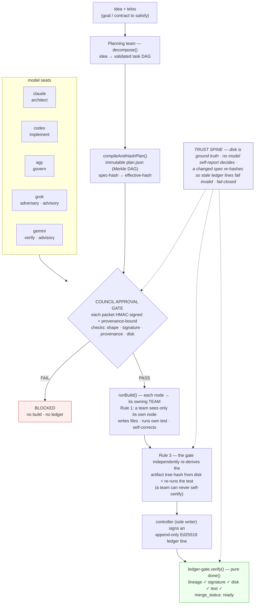

# TELOS

[](https://github.com/dsmcewan/TELOS/actions/workflows/ci.yml)

> An AI agent that grades its own work can rubber-stamp its own mistakes. TELOS
> makes the thing that *builds* never be the thing that *certifies*: a build's
> claim is data; the disk is the truth.

**AI-native systems engineering with a deterministic trust spine.** Models may
propose, implement, and review, but merge-readiness comes from disk evidence,
content hashes, signatures, provenance, and reproducible checks—not a model's
self-report.

The required council is exactly `claude`, `agy`, and `codex`; `grok` and
`gemini` are advisory. `agy` is a deterministic local governance attestation,
not a remote model. A gate result can certify `merge_status: "ready"`.
Implementation authority, acceptance, and merge remain separate human decisions
held by **The Eye**.

Core packages: **Node ≥18 · zero runtime dependencies · MIT**

## Two-minute fail-closed proof

From a fresh clone—no install, API key, service, or network access:

```bash
node docs/runs/fail-closed-demo/run.mjs
```

Expected:

```text
BLOCKED  tampered required-seat packet: signature invalid
HALTED   out-of-bounds action: not executed; needs-human recorded
VERIFIED HMAC gate + Ed25519 decision ledger; tamper rejected
{"ok":true,"gate":{"status":"blocked","reason":"invalid-signature","tampered_packet_rejected":true},"operator":{"status":"needs-human","action_executed":false,"inbox_open":1,"ledger_verified":true,"tampered_ledger_rejected":true,"signature_algorithm":"Ed25519"}}
```

The script signs a valid required-seat trio, changes one signed field, and
requires the real gate to reject it specifically for signature invalidity. It
then proposes an over-cap operator action, proves the action was never called,
records `needs-human`, verifies the Ed25519 decision ledger, changes one ledger
field, and requires verification to fail.

## Governed build path



The diagram is the **governed build path**, not the complete repository map. The
required seats produce HMAC-signed, provenance-bound packets; the gate blocks or
certifies merge-readiness; build workers write and self-correct; independent
verification re-derives disk state; and the controller records settlement in an
Ed25519 ledger. The terminal is `merge_status: "ready"`, never an autonomous
merge.

## From authority to implementation

TELOS inherits an institution before it executes a plan:

1. [`CURRENT-AUTHORITY.json`](CURRENT-AUTHORITY.json) names the one active plan
   and authorization; superseded records cannot govern new work.
2. Institutional memory and the applicable comprehension gate establish what a
   worker must understand before implementation.
3. **Daedalus** matures implementation plans. Convergence is submission, not
   authorization.
4. **TELOS** governs review evidence and records the model council's
   authorization outcome.
5. **The Eye** grants non-delegable implementation authority and accepts or
   refuses completed slices.
6. **Argo** is the implementation role carrying authorized work through code,
   verification, and documentation. No autonomous Argo service exists.
7. **Clotho** creates and maintains graph threads, **Lachesis** measures
   dependency and blast radius, and **Atropos** currently verifies recorded
   supersession consistency. Retirement action remains human-governed.

Start with [`AI-START-HERE.md`](AI-START-HERE.md) for the exact load order and
[`repository-manifest.json`](repository-manifest.json) for the architectural
map.

## When automation must stop

The crossroad-ads Phase 2 operator is deliberately **ARMED, awaiting go-live**:
it can create only `PAUSED` campaign objects, while activation remains a human
action. Missing credentials, quota failures, and out-of-bounds budget changes
become `needs-human` records and halt instead of fabricating success.

The mechanism and keyless negative controls are committed in
[`OPS-README.md`](docs/runs/crossroad-ads/OPS-README.md),
[`test-ads-ops.mjs`](docs/runs/crossroad-ads/test-ads-ops.mjs),
[`operator.mjs`](forge/operator.mjs), and
[`test-operator.mjs`](forge/scripts/test-operator.mjs). The live
`workdir/needs-human.jsonl`, `workdir/INBOX.md`, and operator ledger are
runtime/gitignored artifacts; this README does not pretend a particular signed
go-live refusal is committed.

## System map

The complete package classification comes from
[`package-roots.json`](clotho/memory/CONTRACTS/package-roots.json) and the
[`Iliad enrollment contract`](docs/institutional-memory/iliad/CONTRACTS/enrollment.json).

| Boundary | Current members | Status |
| --- | --- | --- |
| Enrolled TELOS spine | `atropos`, `breakout`, `build-gate`, `clotho`, `connectors/ai-peer-mcp`, `lachesis`, `merkle-dag` | Implemented and consciously enrolled |
| Products beside the spine | `ai-forge`, `ai-native-memory`, `forge`, `narcissus/flagship`, `saas-forge` | Implemented; Iliad enrollment deferred |
| Active role/capability modules | Daedalus, TELOS, Argo, The Iliad, `loadout` | Protocol/code/run lineage; no autonomous role services |
| Registered future roles | [Hermes, Medusa, Narcissus](docs/mythological-vocabulary.md#registered-terms) | Meanings reserved; unimplemented |

`contracts/` contains the human-readable protocols; it is a reference boundary,
not another package root. The implemented `narcissus/flagship` product is
distinct from the registered, unimplemented Narcissus role.

### AI-native memory

[`ai-native-memory/`](ai-native-memory/) packages the repository's
institutional-memory discipline as a portable, zero-dependency Claude Code
plugin/product. It ships `/memory-init`, `/memory-audit`, `/memory-verify`, and
`/memory-gate`; memory-standard, authoring, and lifecycle skills; and auditor,
comprehension, and adversarial-review agents. Its own authority and `memory/`
records dogfood the same audit, verification, and comprehension oracles.

`memory-init` scaffolds host-local authority and record files, so a fresh host
does not need TELOS paths. The TELOS dogfood authority path is evidence for this
repository, not a portability requirement. See the
[`package metadata`](ai-native-memory/package.json),
[`plugin metadata`](ai-native-memory/.claude-plugin/plugin.json), and
[`dogfood evidence`](ai-native-memory/memory/EVIDENCE/README.md). Marketplace
publication and Iliad enrollment remain deferred.

## Terminology

| Term | Meaning here |
| --- | --- |
| **telos** | The goal or contract being pursued. **TELOS** is the registered governance role and repository name. |
| **seat** | One independently routed build or review participant with its own packet and provenance. |
| **gate** | Deterministic validation that blocks on missing, invalid, or contradictory evidence. |
| **breakout** | Adversarial self-challenge plus verification against facts on disk. |
| **agy** | The deterministic local governance checkpoint/attestation occupying one required seat. |

## Autonomous builder (agentic-teams)

The council only *approves*; the merkle-dag substrate only *executes* anonymous
worker nodes. The agentic-teams layer composes them so **a build/verify team IS a
`runBuild` worker** — it sees only its node's spec (Rule 1) and its output is
independently re-derived by the gate (Rule 3), so a team's self-report can never
satisfy the gate.

```
idea + telos
  → [planning team] decompose() → tasks[]
  → compileAndHashPlan() → content-addressed plan; writePlan()
  → COUNCIL APPROVAL GATE: runCouncil → validateRecords   (must pass before any execution)
  → runBuild(): each node dispatched to its owning team (team = worker)
  → Rule-3 verify: re-derive the artifact tree-hash + run the node's own test
  → settle: the controller (sole writer) signs the Ed25519 ledger
  → ledger-gate.verify() done() → merge_status: "ready"
```

- **Team placement by strength** (`teams.mjs` + `model-profiles.mjs`): each lead is
  matched to its model's strength (a test asserts every lead's role is in that
  model's `preferred_roles`) — planning/architecture/frontend → claude,
  backend/evals → codex, security/business/breakout → grok, ops → agy,
  **integrity → gemini**. `planTeams(dossier)` sizes the roster from the job.
- **Situational awareness** (`situation.mjs`, pure read-only): greenfield vs
  brownfield, write-target collisions, and the project's real test command —
  reported before building, never used to self-certify.
- **Runtime adaptation** (`test-runner.mjs`): after a team writes its node's files,
  its own node test runs; on failure the team is re-called with the failure detail
  to self-correct (bounded), then the substrate's halt → mutate → re-dispatch gives
  a second, outer adaptation level.

## Proposal lifecycle: Daedalus → TELOS → Argo

The agentic-teams path answers whether built evidence is merge-ready. The
proposal lifecycle begins earlier and keeps three events separate:

1. **Daedalus convergence** — planning seats stop objecting and submit a frozen
   candidate.
2. **TELOS authorization** — required model seats review the exact candidate;
   one required dissent blocks and the signed run records `AUTHORIZED` or
   `NOT_AUTHORIZED`.
3. **The Eye's implementation authority** — the human authority holder decides
   whether Argo may carry that plan through implementation, verification, and
   documentation.

Model convergence does not authorize. A TELOS council result does not execute.
Argo does not choose scope, and no autonomous Argo service exists.

```text
idea + telos
  → Daedalus workshop → converged candidate with content-addressed rounds
  → compileAndHashPlan() → immutable candidate + obligations
  → TELOS cold review of the exact plan hash
  → typed concerns + deterministic gate → AUTHORIZED | NOT_AUTHORIZED
  → The Eye grants or refuses implementation authority
  → Argo carries the authorized plan through code + verification + documentation
  → The Eye accepts or refuses the slice; maintainers decide merge
```

The governing rule, and the one most likely to catch a design flaw: **no mutable
label keys an enforcement decision; every enforcement identity is a
controller-derived content address.** So `proposal_ref` is the recomputed plan
hash (never `build_id`), obligation identity is a hash of its semantics (never a
label), the gate reconstructs concern state from the ledger (never a
caller-supplied array), and `runBuild` reads authorization from disk (never a
caller-supplied selector).

- **Sole-writer, atomic ledger** (`proposal-recorder.mjs` + `proposal-ledger.mjs`):
  a durable controller key; every append rereads + verifies + derives the head
  under one lock, so holds, TTL expirations, and later evidence safely span
  processes and a self-fork is impossible.
- **Model judgment is an interrupt, not a certificate** (`concerns.mjs`): evidence
  certifies; audited judgment blocks or holds; deterministic policy decides. A
  judgment-only hold fails safe (liveness, not integrity); a verified blocker needs
  independently re-verifiable evidence.
- **Sandboxed evidence** (`evidence.mjs`): a frozen closed whitelist; executable
  evidence runs in a real filesystem + network namespace and is rejected without
  execution when isolation is unavailable.
- **Calibration, not authority** (`standing.mjs`): reviewer standing is recomputed
  from the ledger, influences hold TTL / escalation only, and a new concrete model
  version starts conservative (never inherits a predecessor's reputation).

Keyless end-to-end evidence: `docs/runs/proposal-lifecycle/` (authorized→`ready`,
undischarged-obligation→blocked, unauthorized-decision→refused). This subsystem's
own design was put through the process it implements — see
[Designing a trust system by adversarial review](docs/design-by-adversarial-review.md)
(the contract was frozen over three review rounds; the implementation plan was
revised seven times, each answering a numbered findings list, before a line was
written).

## AI Forge (`ai-forge/`)

Pattern-library-driven forge for AI architectures on the unchanged TELOS trust spine.
Phase A is complete: `forge({ pattern: ragPattern, ctx: ragContext(), ... })` returns
`converged: true` over the real gate + Ed25519 ledger + merkle-dag (see `docs/runs/ai-forge-rag/`).
Phase B is complete: every forge run now also emits a gate-verified `DESIGN.md` via a
generic `design` workstream — the architecture design is a first-class, fail-closed
artifact checked against the plan + ledger + built tree (8 workstreams total; all converge).
Phase C is complete: the catalog now includes the self-similar **TELOS pattern** — ai-forge
forges a TELOS-like trust system (7 spine-wrapping components + design; 8 workstreams converge;
see `docs/runs/ai-forge-telos/`).
Phase C.2 is complete: the catalog now also includes **multi-agent**, **eval-harness**, and
**serving+guardrails** patterns — each an independent 8-workstream run converged over the real
gate + Ed25519 ledger (see `docs/runs/ai-forge-{multiagent,eval,serving}/`; PRs #49–60).

## SaaS Forge (`saas-forge/`)

Point the forge at a project and it drives it to **market-ready** the TELOS way:
research the capabilities a SaaS needs → generate each team's artifacts via the
merkle-dag `dispatch` → put **every team through an adversarial breakout decided on
its built artifact** (facts, not trivia) → settle a signed ledger → market gate,
looping until certified.

| Team | Artifact | Breakout asserts (on disk) |
| --- | --- | --- |
| product-architecture | `docs/ARCHITECTURE.md` | references the researched stack |
| business-positioning | `docs/POSITIONING.md` | ICP + differentiation |
| backend-schema | `db/schema.sql` | tables + RLS `create policy` |
| security-trust | `web/site/csp.txt` | `Content-Security-Policy` / `default-src` |
| accuracy-evals | `evals/scorecard.json` + `run.mjs` | precision clears threshold (the test runs the eval) |
| scale-operations | `docs/OPERATIONS.md` | S3 + CloudFront + SLOs |
| frontend-brand-experience | `web/*` + screenshots | brand token, first-screen proof band |

Market packets are **generated from the breakout records**, never hand-asserted,
and the gate independently re-verifies every team's record on disk.

## Trust model (fail-closed)

- Each required seat's packet is **HMAC-signed** and carries **real provenance**:
  the server-issued response id for remote models (claude/grok/codex/gemini), or a
  content-addressed **local attestation** (`agy-<sha256>`) for the deterministic
  agy seat. No structured provenance ⇒ `response_id: null` ⇒ the gate blocks, as
  does a placeholder id or a `response_id` shared across two seats — **no seat
  borrows another's id**. What the gate cannot do from disk is prove a well-formed,
  *unique* id is genuine rather than fabricated (it can't re-contact the API); that
  binding to the real response is made by the council wiring at generation time,
  with the per-seat HMAC secret as the identity floor. (grok and gemini ride as
  **advisory** — a missing key for them never blocks the gate.)
- **Structured output is reliability, not trust.** The schema carries only
  *judgment* (the approval schema omits identity); the gate re-validates packet
  shape, injects identity from the dossier, and binds provenance to the real API
  response — so a model can't self-assert its identity or approval.
- Under `trust_mode: "signed"` the gate enforces **both** the signature and the
  provenance as blockers. The gate always re-reads disk ground truth.
- **Secrets live outside the repo** (env / OS registry): `ANTHROPIC_API_KEY`,
  `XAI_API_KEY`, `OPENAI_API_KEY`, `GEMINI_API_KEY`, and the `TELOS_SECRET_*` HMAC
  secrets. Runtime `.telos/` artifacts (plan/ledger) are created ephemerally in the
  build tree.

## Honest boundaries

- The gate, ledgers, metrics, supersession verifier, plugin oracles, forges, and
  their tests run locally. Provider-backed council calls require the provider's
  configured credentials.
- TELOS authorization certifies only the checked merge-readiness predicates. It
  does not execute code or merge a branch.
- No autonomous Argo or Iliad service exists. Those names describe governed
  roles and lifecycle protocols.
- Model consensus is not human authority. The Eye's implementation and
  acceptance authority is non-delegable.
- Per-seat HMAC is an integrity and binding floor for the honest-but-careless
  threat model. One owner holding every seat secret can forge those packets; it
  is not non-repudiation.
- The gate checks provenance shape, uniqueness, and signature binding from disk.
  It cannot prove a well-formed response id was genuinely issued without
  re-contacting the provider.
- Clotho is advisory and non-sandboxed. Green checks prove only the predicates
  they execute.
- Implemented sibling products are not thereby enrolled in the TELOS spine.

## Verification

The core, forge, plugin, and enrolled spine packages are Node ≥18 ESM with zero
runtime dependencies. CI runs them under Node 18 and 20. The
`narcissus/flagship` product is the explicit exception: it requires Node
`^20.19.0 || >=22.12.0`, uses a tracked npm lockfile, and has its own install,
audit, unit, evidence, graph, build, and browser pipeline.

Fast public proof:

```bash
node docs/runs/fail-closed-demo/run.mjs
node docs/institutional-memory/verify-contracts.mjs
node docs/runs/clotho-self-weave/run.mjs --verify-committed
```

Complete local package suite, with every command safe to paste independently
from the repository root:

```bash
npm --prefix build-gate test
npm --prefix breakout test
npm --prefix connectors/ai-peer-mcp test
npm --prefix merkle-dag test
npm --prefix saas-forge test
npm --prefix ai-forge test
npm --prefix forge test
npm --prefix clotho test
npm --prefix ai-native-memory run check
npm --prefix ai-native-memory test
npm --prefix lachesis test
npm --prefix atropos test
```

Flagship pipeline under Node 20:

```bash
npm --prefix narcissus/flagship ci
npm --prefix narcissus/flagship audit --audit-level=moderate
npm --prefix narcissus/flagship test
npm --prefix narcissus/flagship run verify:evidence
npm --prefix narcissus/flagship run verify:coverage
npm --prefix narcissus/flagship run check:live-graph
npm --prefix narcissus/flagship run build
(cd narcissus/flagship && npx playwright install --with-deps chromium)
npm --prefix narcissus/flagship run test:e2e
```

## Docs & evidence

- [`AI-START-HERE.md`](AI-START-HERE.md) — onboarding order and component routing.
- [`CURRENT-AUTHORITY.json`](CURRENT-AUTHORITY.json) — the one active plan,
  authorization, implementation holder, and superseded chain.
- [`repository-manifest.json`](repository-manifest.json) — architectural map,
  role ownership, claims, and explicit non-claims.
- [`docs/institutional-memory/`](docs/institutional-memory/) — machine-first
  authority, invariants, decisions, comprehension gates, and executable
  contract verification.
- [`docs/runs/clotho-self-weave/`](docs/runs/clotho-self-weave/) — committed,
  signed knowledge-graph snapshot and read-only reproduction verifier.
- [`ai-native-memory/memory/EVIDENCE/README.md`](ai-native-memory/memory/EVIDENCE/README.md)
  — portable plugin dogfood and inheritance evidence.
- [`docs/runs/crossroad-ads/`](docs/runs/crossroad-ads/) — bounded `PAUSED` ads
  operator, `needs-human` behavior, and keyless negative controls.
- [`narcissus/flagship/src/evidence-ledger.json`](narcissus/flagship/src/evidence-ledger.json),
  [`live-graph.json`](narcissus/flagship/src/live-graph.json), and
  [`screenshots/`](narcissus/flagship/screenshots/) — the implemented “Loom on
  Trial” product's evidence, graph, and visual proof.
- [`docs/runs/`](docs/runs/) — authorization refusals and successes, Argo slice
  evidence, proposal-lifecycle runs, Clotho evidence, and product runs.
- [`contracts/`](contracts/) — human-readable protocols enforced by the gate.
- [`docs/history/`](docs/history/) — superseded records retained for provenance;
  they do not govern current work.

## Provenance

TELOS is human-directed and developed with multiple model seats. The repository
dogfoods its own deterministic review, evidence, signature, negative-control,
and institutional-memory mechanisms; generated text or code is still data, not
authority or certification.

The project began inside a larger multi-model vault. This repository now
contains standalone executable packages and committed evidence, while live
provider wiring remains credential-dependent and environment-specific.
