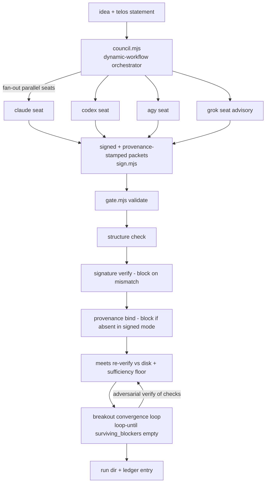

# TELOS Upgrade — Load-Bearing Trust + Dynamic-Workflow Council

> **One-line telos:** Move TELOS from a *promising scaffold* to a *load-bearing discipline* by making gate approvals trustworthy (signed + provenance-bound), making the council a real dynamic workflow instead of hand-authored JSON, and proving it by having TELOS gate its own upgrade.

## 1. Background & Motivation

A maturity assessment (2026-06-27, 9-agent workflow, real test execution + adversarial critique) scored TELOS **7/10 — promising-scaffold**. The engine is near-powerhouse and every test suite runs green, but the *premise* that gives TELOS its name (multi-model approval) is unexercised. Four gaps keep the "yet" attached:

| # | Gap (from assessment) | Addressed by |
|---|---|---|
| 1 | **Identity is unauthenticated.** A single actor can author `claude`/`agy`/`codex`/`grok` packets; provenance only *warns*, never blocks; even the dogfood's `response_id` is a hand-typed `"codex_self"`. | §4.1 signing + §4.2 provenance-as-blocker |
| 2 | **The live-MCP path has never run end-to-end.** All tests use a faked in-process transport; `live.mjs → ai-peer-mcp → Anthropic/xAI` has zero executed coverage. | §4.4 council orchestrator (`--live` capture) |
| 3 | **It has never gated a real build.** All 8 dossiers live under `examples/`; no `runs/`, no ledger, not referenced by the vault's `CLAUDE.md`; the one real vault-mutating workflow bypasses it. | §4.7 recursion run (first real customer) |
| 4 | **Sufficiency is weak; re-verify root is attacker-chosen.** `file_exists` passes on an empty stub; `file_contains` is a whole-file substring match; the re-verify base dir is `affected_directories[0]` from the dossier itself. | §4.3 sufficiency hardening |
| 5 | **Two real bugs.** `test-gate.mjs` is CWD-relative and ENOENTs from the V4 base dir; `npm test` silently skips `stress-tests.mjs` **and all breakout suites**, despite `gate.mjs` hard-importing `breakout/verifier.mjs`. | §4.5 bug fixes |

### Decisions locked in dialogue

- **Goal / center of gravity:** make TELOS *load-bearing* — gate approvals you can trust.
- **Threat model:** *honest-but-careless* (local single-owner vault). Defend against accidental rubber-stamping and one model approving as another by mistake — **not** against a determined vault owner. Mechanism: per-model HMAC signing + provenance promoted from warn to **block**, with the residual documented honestly.
- **New directive:** *code dynamic workflows into TELOS where necessary* — the council and breakout convergence become real fan-out / loop-until-converged orchestration, not hand-authored fixtures.
- **Edit boundary:** I (claude-code) edit `shared/Coordination/*` (contract) and everything under `me/claude-code/telos-upgrade/` directly. All `me/codex/` engine changes ship as a single reviewed `ENGINE.patch` + new-file set for Codex to merge. **Engine isn't live until Codex merges; contract + recursion artifacts are live on write.**

## 2. Goals & Non-Goals

**Goals**
- G1. A gate "pass" in `trust_mode: "signed"` cannot be produced by a single careless actor without the per-model secrets, and carries provenance bound to a real model response.
- G2. The council (capability/approval/market packets) and breakout convergence run as real dynamic workflows, capable of generating packets from actual model calls.
- G3. At least one real `--live` run is captured to disk (closes "live path never run").
- G4. TELOS gates this very upgrade end-to-end, producing the first real (non-`examples/`) run + ledger entry.
- G5. The two real test bugs are fixed; `meets` evidence has a stronger sufficiency floor.

**Non-Goals (YAGNI / explicitly out of scope)**
- N1. Asymmetric/PKI identity, certificate chains, revocation, tamper-evident ledgers (that's the *adversarial/external* threat model — not chosen).
- N2. Defeating a malicious vault owner who holds all secrets (documented residual, not a goal).
- N3. Independent offline verification of `response_id` provenance (not possible without the provider; provenance is a *binding*, not a *proof of content*).
- N4. Rewriting the existing 8 `examples/` to mandatory-signed — they stay in legacy mode (back-compat).
- N5. Any unrelated refactor of `gate.mjs` beyond what these features require.

## 3. Architecture Overview

**Seven well-bounded units.** Each has one purpose, a documented interface, and is independently testable.

## 4. Components

### 4.1 `sign.mjs` — packet signing *(new engine file → ships in ENGINE.patch)*

- **Purpose:** tamper-evident packet integrity + per-model identity floor.
- **Interface:**
  - `canonicalize(packet) → string` — deterministic JSON (sorted keys, excluding the `signature` field).
  - `signPacket(packet, secret) → packet'` — returns the packet with `signature: { alg: "HMAC-SHA256", value: <hex>, signed_fields: "canonical-minus-signature" }`.
  - `verifyPacket(packet, secret) → { ok: boolean, reason?: string }` — recompute + constant-time compare.
- **Secrets:** loaded from environment, keyed per model (e.g. `TELOS_SECRET_CLAUDE`). Precedent exists — `stress-tests.mjs` already loads env vars from `HKCU`. Missing secret → verification cannot pass (treated as block in signed mode).
- **Depends on:** `node:crypto` only. No filesystem, no network. Pure → trivially unit-testable.

### 4.2 `gate.mjs` — trust enforcement *(patch)*

- New dossier flag **`trust_mode: "signed"`** (absent / `"legacy"` = current behavior).
- In signed mode, after the existing structural validation, for each **required** model packet (`claude`, `agy`, `codex`):
  1. **Signature:** `verifyPacket` against that model's secret → **blocker** on missing/invalid signature.
  2. **Provenance:** packet must carry a `provenance` block whose `response_id` is non-empty and not a self-placeholder (reject known placeholders like `*_self`) → **blocker** if absent/placeholder.
- `grok` remains advisory (signature verified if present; absence warns, not blocks).
- New `headline_checks` entries: `signing`, `provenance` — so a minimal dossier can't silently skip them.
- **Back-compat:** legacy-mode dossiers (the 8 examples) behave exactly as today.

### 4.3 `gate.mjs` — `meets` sufficiency hardening *(patch)*

For any market packet claiming `lexi_class_ui_status: "meets"` and its breakout record's `checks`:
- Reject `file_exists` that resolves to a **zero-byte** file when used as `meets` evidence (an empty stub is not evidence).
- Require **≥1 `file_contains`** check among the record's gate-verifiable checks (existence alone is insufficient).
- Emit a **warning** (not a blocker) that the re-verify root is dossier-chosen (`affected_directories[0]`), surfacing the honest residual louder rather than hiding it.
- The existing rules stand: `command` specs are recorded but **never executed**; a record with *only* `command` specs is blocked.

### 4.4 `council.mjs` — dynamic-workflow orchestrator *(new engine file → ships in ENGINE.patch)*

- **Purpose:** this is the "code dynamic workflows into TELOS" deliverable — the council + breakout convergence as real orchestration, not hand-authored JSON.
- **Behavior:**
  - **Dynamic sizing (added 2026-06-27 per user request):** `planSeats(dossier)` computes the roster *from the job* — required approval seats (`claude`/`agy`/`codex`) always, `grok` advisory, plus one `market-lens` seat per `required_market_workstreams` entry when `market_bound`. The agent count is therefore a **function of the dossier**, not a fixed roster (this is how TELOS "determines how many agents per job"). `runCouncil` executes the seats through a **CPU-aware bounded pool** (`maxConcurrency` = `min(requested, os.cpus().length − 2)`), mirroring the workflow engine's cap so a large fan-out cannot thrash the host.
  - **Fan-out:** parallel seats (`claude`/`codex`/`agy`/`grok`) each produce capability + approval (+ market, when market-bound) packets. Each returned packet is **signed** (`sign.mjs`) and **provenance-stamped** from the real model response.
  - **Convergence (breakout):** `loop-until(surviving_blockers empty OR maxRounds reached)`. Each round runs **perspective-diverse adversarial verification** of the `meets` checks (distinct lenses, not N identical re-checks), feeding survivors into the next round. Mirrors the loop-until-dry / adversarial-verify patterns.
  - **Output:** writes signed packets + a breakout record to a run directory.
- **Transports (one interface, two impls):**
  - `--live` — real `ai-peer-mcp` via the existing `mcp_client.mjs` / `live.mjs` (requires API keys). Used for the G3 capture run.
  - faked / replay — offline in-process transport (the one the current tests use) for CI and dev.
- **Failure handling:** a seat that returns null/errors → the orchestrator records "missing required model packet," which the gate then treats as a blocker. `--live` with no keys → **explicit error, no silent fallback** to faked.
- **Depends on:** `mcp_client.mjs`, `sign.mjs`, `verifier.mjs`.

### 4.5 Bug fixes *(patch)*

- `scripts/test-gate.mjs`: resolve fixture paths relative to the script via `new URL('../examples/...', import.meta.url)` so it runs from any CWD (including the V4 base dir).
- `package.json` (`build-gate`): `test` script runs `test-gate.mjs` **+** `stress-test-gate.mjs` **+** `stress-tests.mjs`, and invokes the breakout suites (or breakout's `package.json` `test`) — because `gate.mjs` hard-imports `breakout/verifier.mjs`, that dependency must be covered by the default command.

### 4.6 Contract upgrade — `shared/Coordination/*` *(I edit directly; live on write)*

Update `Multi-Model Agentic Build Gate.md` and `Claude-Led Multi-Model Prototype Workflow.md` to document:
- the **signing requirement** + per-model secret expectation;
- **provenance-as-blocker** under `trust_mode: "signed"` (and that legacy mode warns);
- the **council-as-dynamic-workflow** protocol (fan-out seats → signed packets; breakout convergence loop with adversarial verification);
- the **`meets` sufficiency bar** (no empty stubs, ≥1 `file_contains`, root-is-dossier-chosen caveat);
- the **honest residual** (a determined single owner holding all secrets can still forge; provenance binds identity, it does not prove content).

### 4.7 Recursion run — first real customer *(staged under `me/claude-code/telos-upgrade/runs/`)*

- A real **telos statement** + **dossier** for *this* upgrade (`trust_mode: "signed"`, market-bound).
- Real **signed packets** for `claude`/`codex`/`agy` (+ `grok` advisory), provenance-stamped (from the G3 `--live` capture where available).
- The gate **passes** against this dossier; the breakout `meets` claim is **re-verified against the actual upgrade artifacts on disk** (the `ENGINE.patch`, the new `sign.mjs`/`council.mjs`, the contract edits, this spec).
- First entry in a real **ledger** (`me/claude-code/telos-upgrade/runs/ledger.md`).
- **Provenance dependency (explicit):** signed mode requires real, non-placeholder provenance, which comes from the §4.4 `--live` capture (G3). If no API keys are available at implementation time, the recursion run is **blocked by design** — we do **not** fabricate provenance or a `*_self` placeholder to force a pass. In that case G3 (one real live capture) is a hard prerequisite for G4, and an honest blocked report is the correct interim outcome, surfaced rather than worked around.

## 5. Data Flow

`idea → telos statement → council.mjs fan-out (real or replay model calls) → signed + provenance packets written → gate.mjs validate( structure → signatures → provenance → meets re-verify w/ sufficiency ) → breakout convergence loop (adversarial verify) → meets re-verified vs disk → run dir + ledger entry`

## 6. Error Handling

- Gate exit codes preserved: `0` pass, `1` blocked, `2` usage/read/parse error.
- New blockers carry explicit, human-readable reasons (`signing`, `provenance`, `sufficiency`).
- Council: seat failure → block "missing required model packet"; `--live` without keys → explicit error.
- All new blockers are surfaced in `headline_checks` so a minimal dossier cannot silently run only base checks.

## 7. Testing (Maker–Checker)

**Maker (author the tests alongside the code):**
- `sign.mjs`: roundtrip; tamper-detection (mutated field fails); wrong-secret fails; missing-secret fails.
- `gate.mjs` signed mode: blocks on bad signature; blocks on missing/placeholder provenance; passes on valid signed+provenance packets; legacy mode unchanged (existing 8 examples still pass).
- Sufficiency: blocks `meets` backed only by an empty stub; blocks `meets` with no `file_contains`; passes with real non-empty content.
- `council.mjs`: convergence loop terminates (empty `surviving_blockers`) and on `maxRounds`; adversarial verify runs distinct lenses; faked transport produces signed packets.
- Bug fixes: `test-gate.mjs` runs green from the V4 base dir; `npm test` exit 0 *and* demonstrably executes `stress-tests.mjs` + breakout suites.
- End-to-end: the recursion dossier (§4.7) passes the gate.

**Checker (independent adversarial pass after Maker is green):** a verification workflow re-attacks the result — tries to forge a passing packet without the secret, tries to pass `meets` with weak evidence, confirms the live capture is real. Findings feed a fix round.

## 8. Deliverables & Boundary

| Deliverable | Location | Live on write? |
|---|---|---|
| This spec | `me/claude-code/telos-upgrade/specs/` | ✅ |
| Implementation plan (next step) | `me/claude-code/telos-upgrade/specs/` | ✅ |
| `ENGINE.patch` (gate.mjs trust + sufficiency + bug fixes) | `me/claude-code/telos-upgrade/` | ❌ until Codex merges into `me/codex/` |
| New engine files (`sign.mjs`, `council.mjs`) + their tests | `me/claude-code/telos-upgrade/engine/` | ❌ until Codex merges |
| Contract edits | `shared/Coordination/*.md` | ✅ |
| Recursion run (dossier, signed packets, breakout record, ledger) | `me/claude-code/telos-upgrade/runs/` | ✅ |

**Boundary rule:** no hand-edit of `me/codex/` files. Engine changes are delivered as a reviewed patch + new-file set for Codex/you to apply.

## 9. Phasing (single spec, incremental plan)

1. **Phase 1 — Trust layer:** `sign.mjs`, gate signed-mode (signature + provenance blockers), sufficiency hardening, bug fixes + tests. *(Closes gaps 1, 4, 5.)*
2. **Phase 2 — Dynamic-workflow council:** `council.mjs` fan-out + breakout convergence + adversarial verify, both transports; one real `--live` capture. *(Closes gap 2, fulfills the dynamic-workflow directive.)*
3. **Phase 3 — Recursion:** assemble the real dossier + signed packets, run the gate to a pass, re-verify `meets` vs disk, write the ledger; update the contract. *(Closes gap 3.)*

## 10. Success Criteria

- ✅ A `trust_mode: "signed"` gate pass requires valid per-model signatures + real-bound provenance; a packet without the secret cannot pass (proven by an adversarial test).
- ✅ `council.mjs` produces signed packets and runs a terminating convergence loop on the faked transport; ≥1 real `--live` run captured to disk.
- ✅ `npm test` (build-gate) exits 0 *and* executes `stress-tests.mjs` + breakout suites; `test-gate.mjs` runs from the V4 base dir.
- ✅ `meets` can no longer be backed by an empty stub or existence-only checks.
- ✅ TELOS gates this upgrade: a real `runs/` dossier passes, `meets` re-verified against the actual upgrade artifacts, first ledger entry written.
- ✅ Contract documents signing, provenance-as-blocker, the council workflow, the sufficiency bar, and the honest residual.

## 11. Honest Residual (carried forward, documented not hidden)

- A determined single owner holding all per-model secrets **can still forge** all approvals. The HMAC floor defeats *careless* cross-signing and accidental rubber-stamping, not a malicious owner. (By design — chosen threat model.)
- Provenance **binds** a packet to a model response; it does not independently prove the response's *content* offline.
- The `meets` re-verify root is dossier-chosen; sufficiency hardening raises the bar but cannot fully resolve the circularity when the author picks the root. Choosing meaningful checks remains the council's job.
